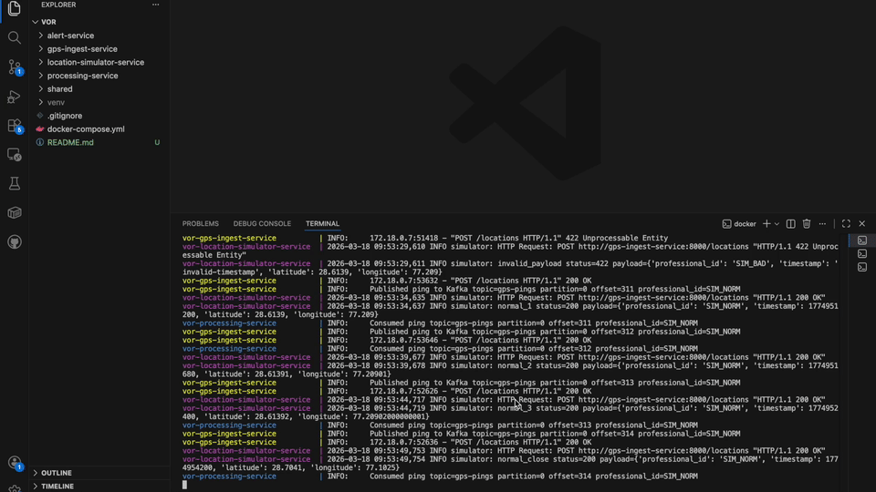

# Vor (Verification of Off-platform Return)

Vor is named after the Norse goddess associated with wisdom and careful inquiry.
Here, Vor stands for **Verification of Off-platform Return**.

Vor is a background investigator for field activity.
A location ping comes in, Vor follows it through a chain of checks, and if the pattern looks like an off-platform revisit, Vor raises an alert.



## What Runs Here

1. `gps-ingest-service`: receives location pings and puts them on Kafka.
2. `processing-service`: builds stays, runs check logic, calculates risk, and emits suspicious events.
3. `alert-service`: consumes suspicious events and serves them via API.
4. `location-simulator-service`: continuously sends test traffic to exercise all paths.

## End-to-End Flow

### Step 1: Ping intake and validation

A ping hits `POST /locations`.
Before it goes anywhere, Vor checks:

1. `professional_id` is present (non-empty).
2. `timestamp` is an integer Unix time.
3. `timestamp` can be converted into a valid UTC datetime.
4. Kafka producer is available.
5. Kafka publish succeeds.

If Kafka is unavailable or publish fails, the API returns `503`.

### Step 2: Startup and dependency checks

Before this story can run, startup checks happen in Docker Compose:

1. Kafka must pass healthcheck.
2. `gps-ingest-service`, `processing-service`, and `alert-service` wait for healthy Kafka.
3. `location-simulator-service` starts only after ingest and processing are started.

### Step 3: Stay detection

In `processing-service`, each new ping is compared with the current stay cluster.
A ping stays in the same stay only if both are true:

1. Distance from stay center is `<= 75m`.
2. Gap from previous ping is `<= 30 minutes`.

If either condition breaks, the old stay closes and a new one begins.
Then one more check:

1. Only closed stays of at least `15 minutes` move forward.

### Step 4: Integrity signals

While pings are flowing, Vor keeps two flags and one home pattern:

1. **Spoofing flag** turns on if implied speed between pings is `> 200 km/h`.
2. **GPS gap flag** turns on if gap is `>= 2 hours` and previous ping time is between `08:00` and `20:59`.
3. **Home cluster** is inferred from pings between `22:00` and `05:59`.

These don’t automatically create alerts, but they influence risk later.

### Step 5: Suspicious-visit eligibility

A completed stay goes through filtering gates. If it fails any gate, it is treated as non-suspicious:

1. **Matched booking gate**: if there is a booking for the same professional within `+/- 2 hours` and within `<= 100m`, this is considered normal.
2. **Reference booking gate**: if no prior nearby repeat-service booking exists (`<= 30m`), stop.
3. **Repeat window gate**: days since reference booking must fit the category window:

| Category | Valid repeat window |
|---|---|
| `home_cleaning` | 5 to 30 days |
| `salon_at_home` | 10 to 45 days |
| `massage_therapy` | 7 to 30 days |
| `ac_servicing` | 60 to 180 days |
| `plumbing` | 30 to 180 days |
| `electrical` | 30 to 180 days |

4. **Home cluster gate**: if stay cluster equals inferred home cluster, stop.

Repeat-service categories used for reference matching are:
`home_cleaning`, `salon_at_home`, `massage_therapy`, `ac_servicing`, `plumbing`, `electrical`.

### Step 6: Risk scoring

If a stay passes all gates, Vor computes risk:

1. Baseline: `+3` (repeat-window condition) + `+3` (unmatched-near-past condition).
2. `+2` if stay duration is `>= 30 minutes`.
3. `+2` if GPS gap flag is true.
4. `+4` if spoofing flag is true.
5. `+5` if same professional already has suspicious visit(s) for the same reference booking.
6. `-2` if this cluster is in the professional’s top 3 common clusters.
7. `+4` if suspicious visits already span at least 2 distinct customers.

Final alert fields:

1. `risk_score = max(0, computed_score)`
2. `flagged = true` when `risk_score >= 7`

### Step 7: Alert publication and retrieval

If suspicious, processing publishes to Kafka topic `suspicious-visits`.
`alert-service` consumes and stores events in an in-memory buffer.

`GET /alerts` behavior:

1. `limit` is allowed from `1` to `500` (default `50`).
2. Results are returned newest first.
3. Buffer size defaults to `1000` (`ALERT_BUFFER_SIZE`).

## Main Endpoints

1. `POST /locations` (`gps-ingest-service`)
2. `POST /pings` (`processing-service`, direct/manual testing path)
3. `GET /alerts` (`alert-service`)
4. `GET /health` (all services)

## Kafka Variables

1. `KAFKA_BOOTSTRAP_SERVERS` (default: `localhost:9092`)
2. `KAFKA_PINGS_TOPIC` (default: `gps-pings`)
3. `KAFKA_CONSUMER_GROUP` (default: `vor-processing`)
4. `KAFKA_ALERTS_TOPIC` (default: `suspicious-visits`)
5. `KAFKA_ALERTS_CONSUMER_GROUP` (default: `vor-alert-service`)

## Run Everything

1. Start

```bash
docker compose up --build
```

2. Stop

```bash
docker compose down
```

## Simulator Scenarios

Each simulator cycle sends:

1. Invalid payload.
2. Normal clustered stay.
3. High-speed spoofing pattern.
4. Long working-hours GPS-gap pattern.
5. Suspicious revisit candidate (`SIM_PRO`) near seeded reference booking.
